# Qt Alati

## Gammaray

Alat `Gammaray` služi za inspekciju qt aplikacija. Ovaj alat je proizvod `KDAB` firme. Ovaj alat nam omogućava da posmatramo i manipulišemo `qt` aplikacijom za vreme izvršavanja. Poprilično je koristan u slučaju da koristimo neke kompleksne qt `framework`-ove kao što su `model/view`, `state machines` ili `scene graph`.

`Gammaray` je projekat [otvorenog koda](https://github.com/KDAB/GammaRay)

## Instalacija

### Kloniranjem repozitorijuma

- `git clone https://github.com/KDAB/GammaRay`
- `cd GammaRay`
- `mkdir build`
- `cd build`
- `cmake -G "Unix Makefiles" ..`

### Preko APT menađera pakete

- `sudo apt install gammaray`

U slučaju problema, pogledati sledeći [link](https://github.com/KDAB/GammaRay/wiki/Known-Issues)

## Pokretanje preko terminala

Da ne bismo pravili od nule projekat za testiranje alata, možemo da uzmemo neki jednostavan projekat kao što je kalkulator sa kursa za razvoj softvera: [izvor](https://github.com/MATF-RS20/zvanicni-materijali)

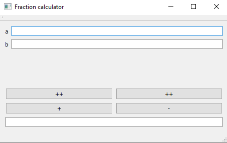

- Možemo preko terminala (ili klasično) da pokrenem `qtcreator`. Lociramo se u `01_calculator`:
  * `qtcreator 03-calcalculator.pro &`
- Preko `qtcreator`-a pokrećemo program.
- U terminalu možemo sad da pokrenemo `gammaray`:
  * `gammaray`
- Očekivani rezultat:

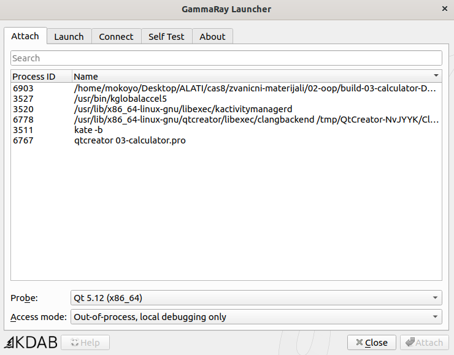

- Potrebno je da izaberemo odgovarajući proces po imenu.
- Kada izaberemove odgovarajući proces, potrebno je pretisnemo dugme `attach`.
- Očekivani rezultat:

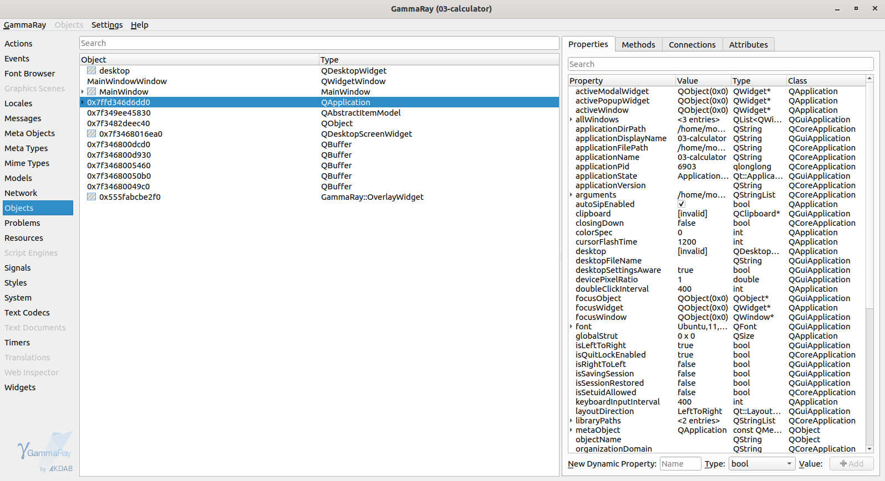

- Ako se vratimo na aplikaciju, videćemo promenu:

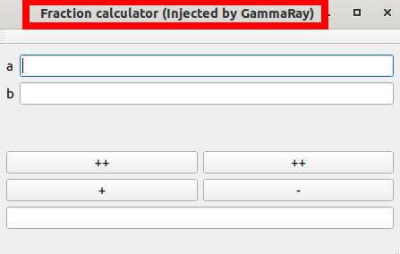

- Alat `gammaray` je ubačen u našu aplikaciju. 

### Pokretanje preko QtCreator-a

- Sada možemo da isključimo aplikaciju i `gammaray` i da namestimo da možemo ovaj alat da pokrećemo preko `qtcreator`-a.
- Potrebno je da kliknemo na `Tools -> External -> Configure...`.
- Očekivani rezultat:

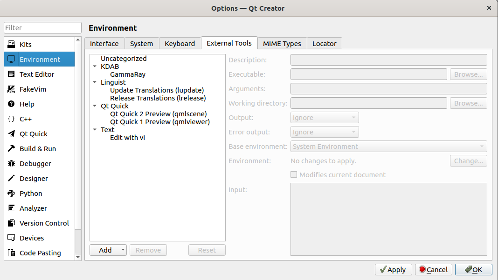

- **Napomena:** Ne očujemo da je `gammaray` već namešten (već sam to uradio).
- Idemo na `Add -> Add Category` i dodajemo novu kategoriju `KDAB`.
- Sada možemo da dodamo novi alat pod `KDAB` kategorijom:

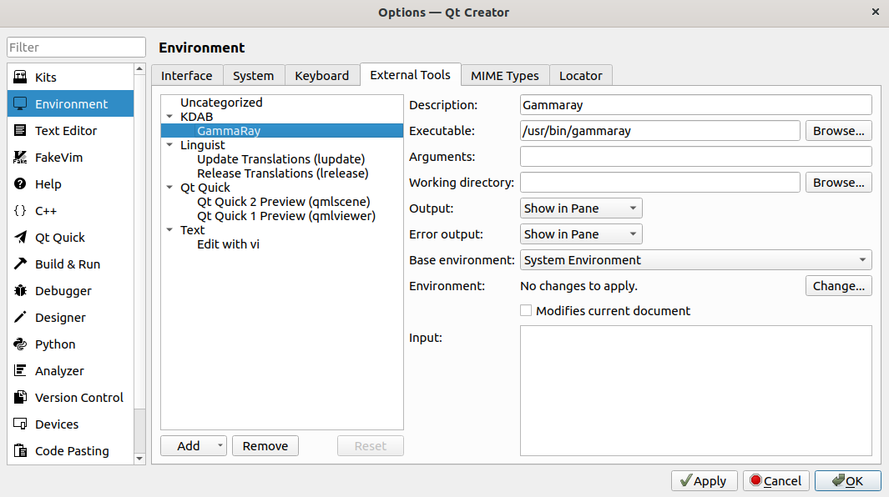

- **Napomena:** Ova putanja odgovara za moj računar. Ako hoćete da vidite gde je instaliran vaš `gammaray`, potrebno je da nađete njegovu putanju:
  * `whereis gammaray`
  
- Na kraju idemo `Ok`. Sada možemo da pokrećemo `gammaray` preko `Tools -> External -> KDAB -> GammaRay`. Takođe možemo da postavimo skraćenicu na tastaturi za pokretanje.

### GammaRay - Events

Ako otvorimo `Events` sa leve strane možemo da vidimo istoriju događaja. Ovde možemo da vidimo ogromnu listu događaja i šta god da radimo u aplikaciji (pa čak i pomeranje piša preko `gui` objekata) dešava se neki događaj. Ako imamo neki `QTimer`, onda će ova istorija biti spamovana. Možemo da pauziramo istoriju za bolju analizu ili da koristimo `search` da filtriramo istoriju. Takođe možemo pod `Types` da isključimo prikazivanje nekih događaja. Primer: Ovde nas ne interesuje `Paint` i možemo da ga izbacimo.

Čest bag kod `qt` aplikacija je da aktiviramo (barem mislimo da aktiviramo) neki događaj (npr. klik na dugme), ali se ništa ne desi ili se desi nešto što nismo očekivali. Ovde možemo da proveravamo da li uopšte taj događaj aktivirao i koji se događaji aktiviraju kao posledica tog događaja.

### GammaRay - Meta Objects

Ovde možemo da vidimo statistike zauzeća resursa po objektima, njihove `atribute (properties)`, njihove `metode (methods)` i njihove `najbrojive tipove (enum)`. Primer: Možemo pogledati atribute i metode za `QButton`.

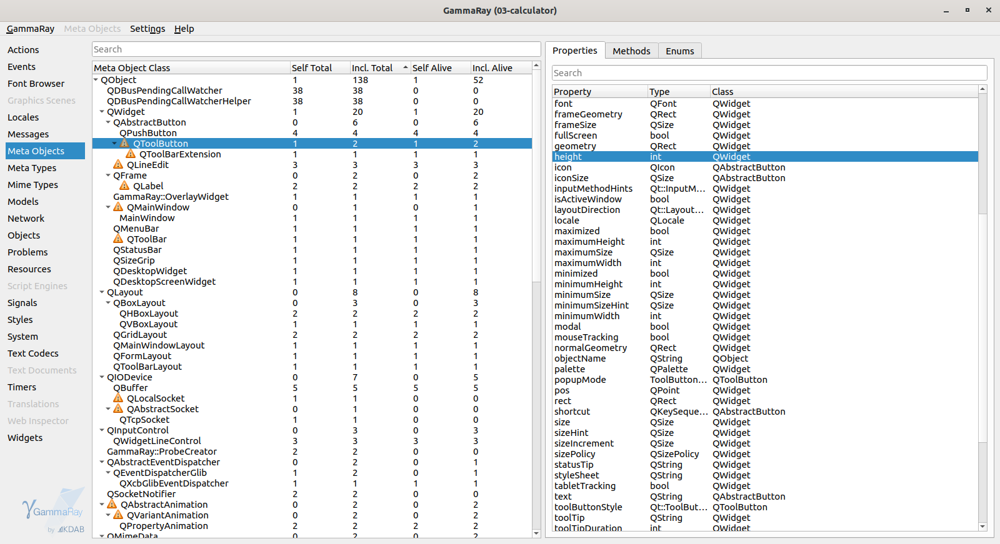

### GammaRay - Meta Types

Ovde možemo da vidmo informacije o tipovima kao što su `bool`, `int`, `QChar`, itd... (npr. njihovu dimenziju u bajtovima).

### GammaRay - Objects

Ovde možemo da vidimo informacije i konkretnim objektima kao što je na primer `MainWindow` u ovom slučaju

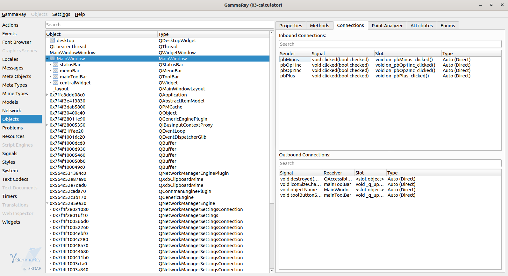

- Ovde vidimo signale i slotove koji se odnose na korišćenje dugmića: 
  * Sender: `pbMinus`
  * Signal: `void clicked(bool checked)`
  * Slot: `void on_pbMinus_clicked()`
  * Type: `Auto (Direct)`
  
### GammaRay - Signals

- Ovde vidimo aktivirane signale sa vremenskim kontekstom. 
- **Napomena:** Vodite računa kada radite sa `QTimer` da vam ne blokira aplikacija (ili računar).
- Ako kliknemo na dugme `+`, onda očekujemo da se pojavi crna linija za `pbPlus`.

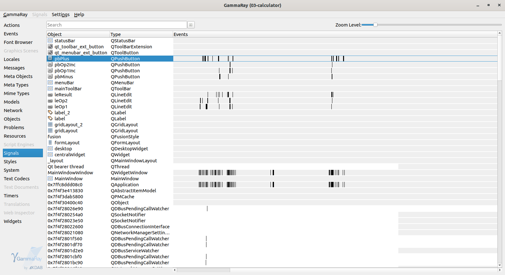

### GammaRay - Widgets

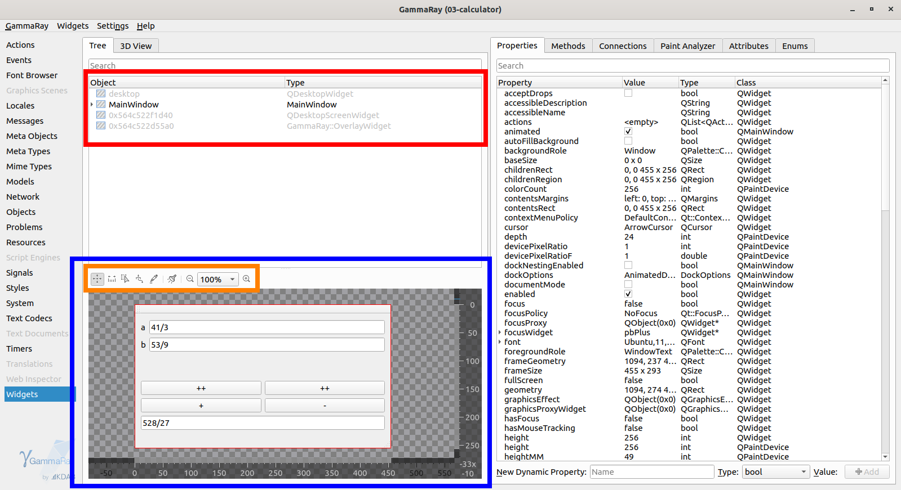

- `Crveni deo` predstavlja listu grupisanih objekata. Svaki objekat možemo da posmatramo kao drvo tj. hijearhiju koja sadrži neke svoje podobjekte (decu). Ako otvorimo `MainWindow` videćemo:
  * `statusBar`
  * `menuBar`
  * `mainMenuBar`
  * `centralWidget` koji sadrži `pbPlus`, `pbOp2Inc`, ...
- Ako nismo sigurni koji su to objekti na slici koja predstavlja `plavi deo`, onda možemo da kliknemo na neki objekat sa liste i `gammaray` će nam označiti odgovarajući objekat na slici. Analogno možemo da izaberemo objekat na slici (treća opcija u narandžastom delu) i da nam prikaže odgovarajući objekat na listi. 
- Ostale opcije `narandžastog dela` podrazumevaju pomeranje slike (prva opcija), merenje stvari u pikselima (druga opcija), provera boja (peta opcija). 
- Čak možemo i da interagujumo sa aplikacijom preko četvrte opcije. 
- Šesta opcija narandžastog dela je `tab order`:

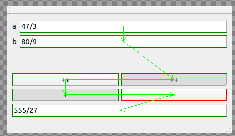

## Reference

[KDAB-GammaRay](https://www.kdab.com/development-resources/qt-tools/gammaray/#GammaRay_Tutorials)
