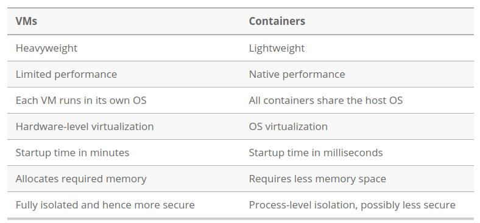
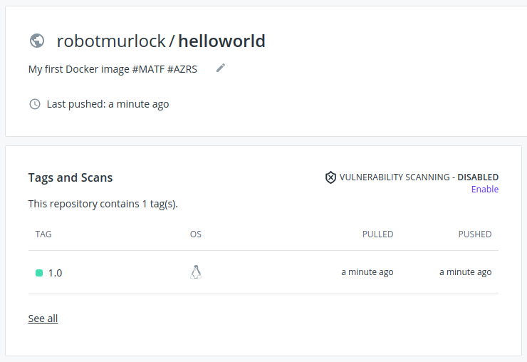

# Docker

## Šta je Docker?

`Docker` je projekat otvorenog koda koji nam omogućava `isporuku (deployment)` aplikacija unutar `kontejnera (container)` tako što nam daje dodatni nivo apstraktnosti i automatizacije [OS-level virtualization](https://en.wikipedia.org/wiki/OS-level_virtualization) za `Linux`.

Ideja je da zapakujemo kod i sve zavisnosti u jednu standardizovani jedinicu koja se naziva `kontejner (container)`. To nam omogućava da brzo i pouzdano instaliramo aplikaciju na više okruženja. 

`Docker slika kontejnera (container image)` je samostalan paket softvera koji sadrži:
* kod
* okruženje
* sistemske alate
* biblioteke
* opcije

Slike kontejnera postaju kontejneri tokom izvršavanja. U slučaju `Docker slika`, slike postaju kontejneri u kada se pokrenu preko `Docker engine`-a.

Slike definišemo (izgrađujemo) preko `Dockerfile` datoteke koja se sastoji iz niza instrukcija. 


## Virtuelne mašine ili kontejneri?


Virtuelne mašine i kontejneri daju slične benefite i sličnu izolaciju, ali funkcionišu drugačije. 

**Kontejneri:**
- Apstrakcija na aplikacionom sloju koji spaja kod i zavisnosti u jedno.
- Više kontejnera mogu da budu na jednom operativnog sistemu i da dele isto jezgro (kernel).
- Obično su znatno manji od virtuelnih mašina: merna jedinica `MB`.
- Brzo se pokreću.

**Virtuelne mašine:**
- Apstrakcija na fizičkom nivou. Više servera umesto jednog servera na istoj mašini.
- `Hipervizor (Hypervisor)` omogućava da se više VM pokreće na jednoj mašini. 
- Svaka VM ima svoju kopiju operativnog sistema, aplikaciju, datoteke... (sve nezavisno). Zbog toga
    zauzimaju više memorije: merna jedinica `GB`.
- Sporo se pokreću. 

**Kad da koristimo kontejnere, a kad virtuelne mašine?**
- Virtuelne mašine su bolje rešenje kada aplikacije zahtevaju sve resurse i funkcionalnosti operativnog sistema ili kada nam je potrebno da imamo više različitih operativnih sistema na raspolaganju.
- Kontejneri su bolje rešenje kada želimo da maksimizujemo broj pokrenutih aplikacija na minimalnom broju servera.



## Prednosti i slučajevi upotrebe Docker-a

- Pojednostavljivanje konfiguracije;
- Izvoz razvojnog koda u produkcioni;
- `Multi-tenant` aplikacije: Više klijenata koristi istu aplikaciju. Kao da je aplikacija proizvod koji se prodaje više puta;
- Produktivnost razvijaoca;
- `Konsolidacija servera`: Jeftinije je imati više kontejner servera nego VM servera;
- Docker nudi alate za debagovanje;
- Brz izvoz (pokretanje kontejnera traje par milisekundi).

## Popularnost Docker-a

Vrlo moguće da će u budućnosti barem osnovno poznavanje `Docker`-a biti neophodno za većinu poslova.


## Instalacija Docker-a

Upustvo za instalaciju se nalazi na sledećem [linku](https://docs.docker.com/get-docker/).

- Moguće je da je neophodno da se konfiguriše `docker` tako da može da se koristi i bez `sudo` opcije. 

## Osnovne komande (01_basic)

Napravili smo `Hello World!` program i želimo da ga `dokerizujemo`. Pišemo `Dockerfile`:
```
FROM gcc:latest

COPY . /usr/src/hello-world

WORKDIR /usr/src/hello-world

RUN g++ -o hello-world main.cpp

CMD ["./hello-world"]
```
- Analiza svake instrukcije:
    * `FROM gcc:latest`: Dohvati već postojeću sliku za `gcc` kao `osnovni sloj` (detaljnije objašnjenje kasnije).
    * `COPY . /usr/src/hello-world`: Kopiraj trenutni direktorijum `.` u `Docker sliku` na putanju `/usr/src/hello-world`.
    * `WORKDIR /usr/src/hello-world`: Postavi putanju `/usr/src/hello-world` kao putanju za radni direktorijum.
    * `RUN g++ -o hello-world main.cpp`: Izvrši komandu (u ovom slučaju kompiliraj c++ kod).
    * `CMD ["./hello-world"]`: Podrazumevana opcija (komanda) za kontejner. Ovo npr. može da bude pokretanje servera.

- Sada je potrebno da izgradimo našu novu sliku preko komande `docker build [PATH]`. **Napomena:** Za sve `docker` komande postoje `man` strane. Argument ove komande je putanja do direktorijuma gde se nalazi `Dockerfile`. U našem slučaju je to trenutni direktorijum `.`. Opcijom `-t` dajemo ime slici (inače je ime `none`):
    * `docker build -t hello-world .`
- Recimo da naš program ima grešku u kodu:
```
#include <iostream>

int main()
{
    std::cout << "Hello World!" << std::endl;
    return 0;
}
```
- Očekivani oblik izlaza:
```
Sending build context to Docker daemon  3.072kB
Step 1/5 : FROM gcc:latest
latest: Pulling from library/gcc
6c33745f49b4: Pull complete 
ef072fc32a84: Pull complete 
c0afb8e68e0b: Pull complete 
d599c07d28e6: Pull complete 
f2ecc74db11a: Pull complete 
1d0bc4d838cf: Pull complete 
fe0232482858: Pull complete 
9e3dd67247b0: Pull complete 
c88ba171063a: Pull complete 
Digest: sha256:9a4fa1492f601ac4dbdca4c6ab4879499a4ac513a5c16bd17f03f48dbdb77383
Status: Downloaded newer image for gcc:latest
 ---> f39d9e39afdb
Step 2/5 : COPY . /usr/src/hello-world
 ---> cfa9937378d4
Step 3/5 : WORKDIR /usr/src/hello-world
 ---> Running in 51b0a310a38e
Removing intermediate container 51b0a310a38e
 ---> f21a201bf8bc
Step 4/5 : RUN g++ -o hello-world main.cpp
 ---> Running in cad02a16ce37
main.cpp: In function 'int main()':
main.cpp:5:32: error: expected ';' before 'return'
    5 |     std::cout << "Hello World!"
      |                                ^
      |                                ;
    6 |     return 0;
      |     ~~~~~~                      
The command '/bin/sh -c g++ -o hello-world main.cpp' returned a non-zero code: 1
```
- Prvi put čekamo jako dugo za izgradnju slike, ali nakon toga je znatno brže, jer su slojevi keširani. Svaki korak nam predstavlja jedan sloj. Osnovni sloj je zasnovan na instrukciji `FROM gcc:latest`. To je 
zapravo slika koja predstavlja osnovu za našu sliku. Svaki sloj predstavlja ulaz u sledeći sloj koji se "nadograđuje". `Docker` je već uspešno izgradio prva četiri sloja. Ako ispravimo kod i pokrenemo opet sliku, dobićemo sledeći očekivani rezultat:
```
Sending build context to Docker daemon  3.072kB
Step 1/5 : FROM gcc:latest
 ---> f39d9e39afdb
Step 2/5 : COPY . /usr/src/hello-world
 ---> 5d1c3c9908ea
Step 3/5 : WORKDIR /usr/src/hello-world
 ---> Running in ab401403a6ce
Removing intermediate container ab401403a6ce
 ---> 5d938885e2e1
Step 4/5 : RUN g++ -o hello-world main.cpp
 ---> Running in 1d4c1a3e74ea
Removing intermediate container 1d4c1a3e74ea
 ---> 62eb52395158
Step 5/5 : CMD ["./hello-world"]
 ---> Running in eb1235f928ee
Removing intermediate container eb1235f928ee
 ---> e83e41d7d431
Successfully built e83e41d7d431
Successfully tagged hello-world:latest
```
- Proverimo da li se slika nalazi na listu postojećih slika:
    * `docker image ls`
- Očekivani rezultat:
```
REPOSITORY          TAG                 IMAGE ID            CREATED             SIZE
hello-world         latest              c329d9d73ac7        55 seconds ago      1.19GB
gcc                 latest              f39d9e39afdb        23 hours ago        1.19GB
```
- Zanemarimo ostale slike pored ove dve.
- Informacije:
    * `REPOSITORY`: ime
    * `TAG`: verzija 
    * `IMAGE ID`: jedinstveni `ID` 
    * `CREATED`: proteklo vreme od kreiranja
    * `SIZE`: dimenzija
- Ako stavimo za `TAG` `latest` dobijamo poslednju verziju te slike. Puno ime slike je `REPOSITORY:TAG`. Primeri: `gcc:10.2`, `gcc:9`, `gcc:latest`.

- Ostalo je još samo da pokrenemo kontejner komandom `docker run [OPTIONS] [IMAGE:TAG]`
    * `docker run --name helloworld hello-world:latest`
- Očekivani izlaz:
```
Hello World!
```
- Možemo da pokrenemo `docker ps` da izlistamo sve aktivne kontejnere:
    * `docker ps`
- Očekivani izlaz:
```
CONTAINER ID        IMAGE               COMMAND             CREATED             STATUS              PORTS               NAMES
```
- Nemamo `helloworld` u aktivnim kontejnerima, jer se aplikacija završila.
- Možemo da izlistamo sve kontejnere tako što dodamo opciju `-a`:
    * `docker ps -a`
- Očekivani oblik rezulata:
```
CONTAINER ID        IMAGE                COMMAND             CREATED             STATUS                     PORTS               NAMES
6268111c8dfd        hello-world:latest   "./hello-world"     2 minutes ago       Exited (0) 2 minutes ago                       helloworld
```
- Kontejner je pokrenut i završen pre `2` minuta.

- Sada znamo da izvedemo ceo sledeći proces:


**Dodatak:**
- Ako pokušamo da pokrenemo neku sliku koji trenutno nemamo, a postoji na "internetu", onda će se izvršiti `docker pull` tj. dohvatiti sliku. Primer `docker run nginx`.

## Docker Hub (01_basic)

`Docker Hub` je `cloud-based` sistem za čuvanje `docker` slika. Na taj način možemo da delimo slike sa drugim korisnicima. Potrebno je da napravimo nalog na sledećem [linku](https://hub.docker.com/).

- Imamo baš dobru i korisnu sliku. Želimo da je podelimo na `Docker Hub`.
- Idemo na [Docker repositories](https://hub.docker.com/repositories) i pravimo repozitorijum:


- Potrebno je da se ulogujemo na `Docker hub` preko terminala:
    * `docker login --username=yourhubusername`
- Nakon ove komande je potrebno da unesemo šifru. Očekivani oblik rezultata:
```
Password: 
WARNING! Your password will be stored unencrypted in SOME/PATH
Configure a credential helper to remove this warning. See
https://docs.docker.com/engine/reference/commandline/login/#credentials-store

Login Succeeded
```

- Postavljamo `tag` na sliku komandom: `docker tag`:
    * U mom slučaju: `docker tag hello-world:latest robotmurlock/helloworld:1.0`
    * U opštem slučaju: `docker tag local-image-name:local-image-tag docker-hub-username/docker-hub-repo:docker-hub-image-tag`
- Guramo sliku na `Docker Hub`:
    * `docker push robotmurlock/helloworld:1.0`
- Očekivani oblik rezultata:
```
The push refers to repository [docker.io/robotmurlock/helloworld]
be292643693d: Pushed 
9418ea5f025d: Pushed 
c680d3a2590f: Mounted from library/gcc 
39b9e1d962cf: Mounted from library/gcc 
0f2dba48740e: Mounted from library/gcc 
bc9cf3b95e72: Mounted from library/gcc 
da87e334550a: Mounted from library/gcc 
c5f4367d4a59: Mounted from library/gcc 
ceecb62b2fcc: Mounted from library/gcc 
193bc1d68b80: Mounted from library/gcc 
f0e10b20de19: Mounted from library/gcc 
1.0: digest: sha256:5c9fcada5cc1276a324072588027e978ef8c330e90fefd129c231da28b6013a4 size: 2630
```
- Očekivani oblik rezultata na `Docker Hub`-u:



- Očekivani rezultat za `docker image ls`:
```
REPOSITORY                TAG                 IMAGE ID            CREATED             SIZE
hello-world               latest              c329d9d73ac7        38 minutes ago      1.19GB
robotmurlock/helloworld   1.0                 c329d9d73ac7        38 minutes ago      1.19GB
gcc                       latest              f39d9e39afdb        23 hours ago        1.19GB
```
- Sada želimo da obrišemo `hello-world` i `robotmurlock/helloworld` slike komandom `docker image rm` ili `docker rmi` skraćeno. Potencijalno je potrebno da se doda opcija `-f` za forsiranje brisanja ako neki kontejner koristi ovu sliku ili slično:
    * `docker rmi hello-world:latest`
    * `docker rmi robotmurlock/helloworld:1.0 -f`

- Izgubili smo našu, ali nema potrebe za brigom. Možemo opet da je dohvatimo sa `Docker Hub`-a, preko `docker pull` komande:
    * `docker pull robotmurlock/helloworld:1.0`

- Očekivani oblik rezultata za `docker image ls`:
```
REPOSITORY                TAG                 IMAGE ID            CREATED             SIZE
robotmurlock/helloworld   1.0                 c329d9d73ac7        43 minutes ago      1.19GB
gcc                       latest              f39d9e39afdb        24 hours ago        1.19GB
```
- Poslednju stvar koju želimo da odradimo je da testiramo ovu sliku tako što napravimo kontejner:
    * `docker run --name another-helloworld robotmurlock/helloworld:1.0`
- Očekivani rezultat:
```
Hello World!
```
- Ako pokrenemo komandu `docker ps -a`, trebalo bi da vidimo da je kontejner `another-helloworld` sa slikom `robotmurlock/helloworld:1.0` bio prethodno pokrenut.

## Promenljive i portovi (02_flaskserver)

Imamo `flask` server koji se sastoji od `app.py` i `index.html`:
- `app.py`:
```
from flask import Flask, render_template
import os
app = Flask(__name__)

color = os.environ.get('BACKGROUND_COLOR')

@app.route('/')
def hello_world():
    return render_template('index.html', color=color)

if __name__ == '__main__':
    app.run(host='0.0.0.0')
```
- `index.html`:
```
<!doctype html>
<html>
  <head>
    <title>Pirate server</title>
  </head>
    <body style="background-color:{{color}}">
    <p>Under a black flag we sail and the sea shall be our empire.</p>
    <p>Who am I? I’m Captain Jack Sparrow!</p>
  </body>
</html>
```
- Server prikazuje jednu stranicu sa odgovarajućom bojom pozadine `color`.
- Instalacija:
    * `sudo apt install python3`
    * `sudo pip3 install flask`
- Pokretanje:
    * `export FLASK_APP=app.py`
    * `flask run`
- Očekivani izlaz:
```
 * Serving Flask app "app.py"
 * Environment: production
   WARNING: This is a development server. Do not use it in a production deployment.
   Use a production WSGI server instead.
 * Debug mode: off
 * Running on http://127.0.0.1:5000/ (Press CTRL+C to quit)
```
- Potrebno je da otvorimo link u pretraživaču. Očekivani rezultat:


- Pogledajmo sledeću liniju:
```
color = os.environ.get('BACKGROUND_COLOR')
```
- Želimo da promenimo boju pozadine i potrebno je da pokrenemo sledeću komandu `export BACKGROUND_COLOR=[COLOR]`:
    * `export BACKGROUND_COLOR=red`
- Pokrećemo opet server. Očekivani rezultat:


- Zašto je ovo ovako komplikovano realizovano kad može u kodu da stoji `color = 'red'`? Ako želimo da dokerizujemo aplikaciju, a ova promenljiva može potencijalno da se menja kasnije (kao i mnoge druge), onda
je potrebno da opet izgradimo sliku za aplikaciju nakon svake promene u kodu. Umesto toga možemo da stavimo `enviroment promenljivu` za boju pozadine. Ako je potrebno da se promeni pozadina, dovoljno je samo da opet pokrenemo sliku sa drugom vrednosću za tu promenljivu.

- Želimo da dokerizujemo naš server kako bismo mogli da postavimo na unajmljeni server.
- Neophodne stvari:
    * Potrebno je da se instalira `python`, ako već nije instaliran.
    * Potrebno je da se instalira `pip`, ako već nije instaliran.
    * Potrebno je da se instalira `flask`, ako već nije instaliran.
- Potrebne biblioteke se obično definišu u `requirements.txt` i instaliraju se sledećom komandom:
    * `pip install -r requirements.txt`
- Na osnovu ovih informacije možemo da napišemo naš `Dockerfile`:
```
FROM ubuntu:20.04

RUN apt-get update -y && \
    apt-get install -y python-pip python-dev

COPY . /usr/src/flaskserver

WORKDIR /usr/src/flaskserver

RUN pip install -r requirements.txt

CMD ["python", "app.py"]
```
- Slojevi:
    * Osnovni sloj je `ubuntu:20.04`
    * Instalacija `python`-a.
    * Kopiranje datoteka.
    * Postavljanje radnog direktorijuma.
    * Instalacija svih potrebnih biblioteka za `python`, što je u ovom slučaju samo `flask`.

- Pravimo sliku:
    `docker build -t flaskserver .`
- Očekivani rezultat za komandu `docker image ls`:
```
REPOSITORY                TAG                 IMAGE ID            CREATED             SIZE
flaskserver               latest              c10ae5336e0d        13 seconds ago      432MB
```

- Sada možemo da pokrenemo server sa crvenom bojom pozadine kao kontejner:
    * `docker run --name red --network="host" -e BACKGROUND_COLOR=red flaskserver:latest`
- **Napomena:** Da bi server radio na `localhost`-u, potrebno je da se doda opcija `--network="host"`.
- Možemo da pokrenemo i server sa plavom bojom bez da pravimo opet sliku:
    * `docker run --name blue --network="host" -e BACKGROUND_COLOR=blue flaskserver:latest`
- Ako hoćemo da pokrenemo opet isti kontejner (isto ime), potrebno je da obrišemo stari:
    * `docker rm red`
    * `docker rm blue`
- Sve informacije o kontejneru možemo da vidimo preko komande `docker inspect [NAME]`. Rezultat je `json`. Filtrirajmo `ENV` promenljive. Očekivani oblik rezultata za `docker inspect blue` (ako je obrisan, napraviti ga opet ili koristiti drugi kontejner):
```
"Env": [
    "BACKGROUND_COLOR=blue",
    "PATH=/usr/local/sbin:/usr/local/bin:/usr/sbin:/usr/bin:/sbin:/bin"
],
```
- Ako imamo više takvih promenljivih, efikasnije je da ih zapišemo u datoteku. Pravimo `env.txt` datoteku sa sledećim sadržajem:
```
BACKGROUND_COLOR=pink
```
- Pravimo novi kontejner na osnovu iste slike:
    * `docker run --name pink --network="host" --env-file env.txt flaskserver:latest`
- **Napomena:** Umesto `--network="host"` možemo da pišemo i `-p 5000:5000` i da otvorimo server preko `localhost:5000`:
    * `docker run --name pink -p 5000:5000 --env-file env.txt flaskserver:latest`
- Svaki kontejner ima svoji `IP + PORT`. Možemo da preslikamo ovo na port na `localhost`-u preko opcije `-p` kao što smo i uradili u prethodnom slučaju. Ovo nam omogućava da pokrenemo više servera u isto vreme na različitim portovima.
- Hoćemo da napravimo još jedan server sa belom pozadinom na portu `5005` (može u drugom terminalu):
    * `docker run --name white -p 5005:5000 flaskserver:latest`
- Očekivani rezultat:
    * `http://localhost:5005/` ima belu pozadinu.
    * `http://localhost:5000/` ima roze pozadinu.

- **Napomena:** Ako želimo da pokrenemo kontejner, ali da nam ne ostane u terminalu, potrebno je da dodamo opciju `-d`.


## ENTRYPOINT i CMD (03_anotherhello)

- Imamo sledeći program:
```
#include <iostream>
#include <cstring>

int main(int argc, char** argv)
{
    if(argc < 2)
    {
        std::cout << "Wrong number of arguments!" << std::endl;
        return -1;
    }

    int n = atoi(argv[1]);
    for(int i=0; i<n; i++)
        std::cout << "Hello World!" << std::endl;

    return 0;
}
```
- Sve što ovaj program radi je: Prima kao argument komandne linije broj `n` i ispisuje `n` puta `Hello World!`.
- Imamo već napisan `Dockerfile` koji je veoma sličan onom iz `01_basic` zadataka:
```
FROM gcc:latest

COPY . /usr/src/hello

WORKDIR /usr/src/hello

RUN g++ -o hello main.cpp

ENTRYPOINT ["./hello"]

CMD ["5"]
```
- **Koja je razlika između ENTRYPOINT i CMD?**
    * `ENTRYPOINT` možemo da posmatramo kao "prefiks komande" tj. deo koji je "uvek" tu kao prefiks.
    * `CMD` možemo da posmatramo kao podrazumevani "sufiks komande" tj. deo koji je "uvek" tu, ako se drugačije ne kaže.
- Pravimo sliku:
    * `docker build -t hello .`
- Pokrenimo kontejner:
    * `docker run hello`
- Očekivani rezultat:
```
Hello World!
Hello World!
Hello World!
Hello World!
Hello World!
```
- Ako ništa ne navedemo, poziva se komanda oblika `[ENTRYPOINT] [CMD]`.
- Pokrenimo kontejner sa argumentom `3`:
    * `docker run hello 3`
- Očekivani rezultat:
```
Hello World!
Hello World!
Hello World!
```
- Ako pokrećemo kontejner kao `docker run [IMGNAME] [ARGS]`, poziva se komanda oblika `[ENTRYPOINT] [ARGS]` tj. zamenjuje se podrazumevani deo `[CMD]` sa `[ARGS]`.
- Možemo čak i da zamenimo `[ENTRYPOINT]` deo opcijom `--entrypoint [VALUE]`:
    * `docker run --entrypoint ls`
- Očekivani rezultat:
```
Dockerfile
hello
main.cpp
```
 
## Reference

[docker](https://www.docker.com/)

[vm-vs-container](https://www.backblaze.com/blog/vm-vs-containers/)

[docker-use-case](https://data-flair.training/blogs/docker-use-cases/)

[free-code-camp-docker](https://www.youtube.com/watch?v=fqMOX6JJhGo&t=5897s&ab_channel=freeCodeCamp.org)

[c++-docker-container](https://devblogs.microsoft.com/cppblog/c-development-with-docker-containers-in-visual-studio-code/)